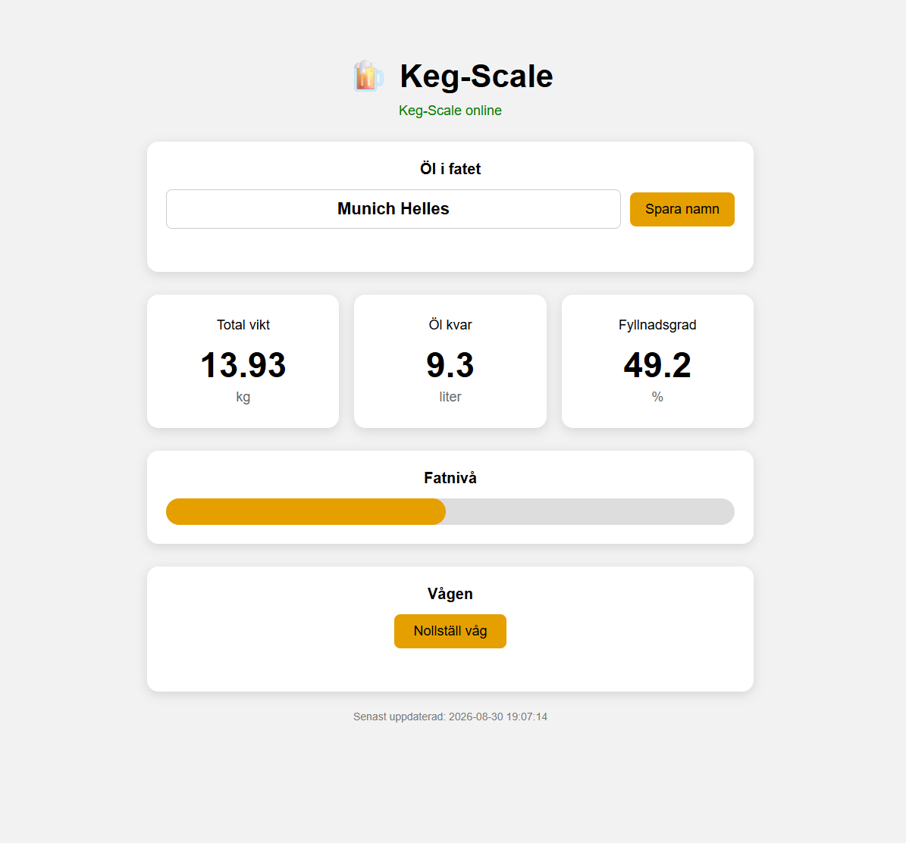
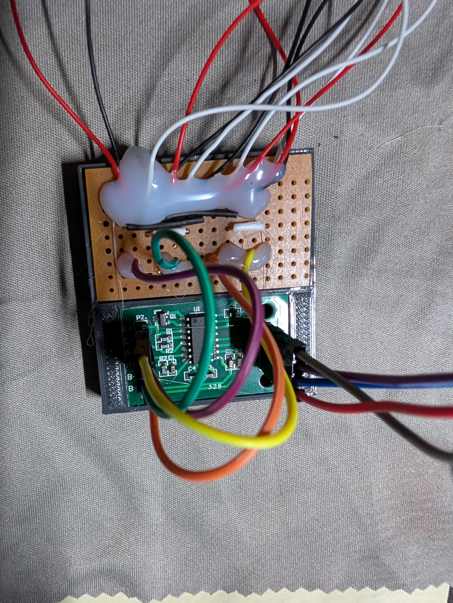

# 🍺 KegScale

**KegScale** är en Raspberry Pi-baserad våg för att mäta hur mycket öl som finns kvar i ett Corneliusfat.

Systemet använder fyra lastceller tillsammans med en HX711 och en Raspberry Pi 5. Vikten läses av kontinuerligt och presenteras i ett webbaserat gränssnitt byggt med Flask.

Webbgränssnittet visar aktuell vikt, mängden öl i liter och fatets fyllnadsgrad. Ölets namn kan ändras direkt från webbsidan och vågen kan även nollställas därifrån.

---

## 🖥️ Web interface



Webbsidan uppdateras automatiskt och visar:

- Ölets namn
- Total vikt
- Mängd öl kvar i liter
- Fyllnadsgrad i procent
- Grafisk nivåindikator
- Online/offline-status
- Tidpunkt för senaste mätningen
- Nollställning av vågen

Ölets namn kan ändras direkt från webbgränssnittet när ett nytt fat ansluts.

Exempel:

```text
Munich Helles
```

Namnet sparas i `config.json` och finns därför kvar efter omstart.

---

## 🔧 Hardware

KegScale använder:

- Raspberry Pi 5
- HX711 load cell amplifier
- 4 × 50 kg lastceller
- Kopplingskort för lastcellerna
- 19 liters Corneliusfat

Fyra 50 kg lastceller ger en nominell total kapacitet på cirka **200 kg**.

### HX711



HX711 förstärker den mycket svaga signalen från lastcellerna och omvandlar den till ett digitalt 24-bitars mätvärde som Raspberry Pi kan läsa.

### Anslutning till Raspberry Pi

| HX711 | Raspberry Pi |
|---|---|
| DT / DATA | GPIO 6 |
| SCK / CLOCK | GPIO 5 |
| GND | GND |
| VCC | Matning |

Programmet använder BCM-numrering:

```python
DATA_PIN = 6
CLOCK_PIN = 5
```

### Kopplingsschema

Fritzing-projekt och kopplingsschema finns i:

```text
hardware/
├── KegScale_bb.pdf
└── KegScale.fzz
```

`KegScale.fzz` kan öppnas och redigeras i Fritzing.

`KegScale_bb.pdf` innehåller kopplingsschemat i PDF-format.

---

## ⚖️ Så fungerar vågen

Kommunikationen mellan hårdvara och webbgränssnitt ser ut så här:

```text
4 × Load cells
       │
       ▼
     HX711
       │
       ▼
Raspberry Pi GPIO
       │
       ▼
  kegscale.py
       │
       ▼
 kegscale.json
       │
       ▼
     Flask
       │
       ▼
   JavaScript
       │
       ▼
  Web browser
```

`kegscale.py` är den enda processen som kommunicerar direkt med GPIO och HX711.

Flask behöver därför aldrig komma åt hårdvaran utan läser endast den information som `kegscale.py` skriver till JSON-filer.

---

## 📏 Mätning och filtrering

För varje viktmätning:

1. 30 mätvärden läses från HX711.
2. Mätvärdena sorteras.
3. De 5 lägsta värdena tas bort.
4. De 5 högsta värdena tas bort.
5. Medelvärdet av resterande 20 mätningar beräknas.

Detta ger en stabilare vikt och minskar påverkan från enstaka störningar.

Små variationer runt noll filtreras också bort:

```python
if abs(vikt_gram) < 5:
    vikt_gram = 0.0
```

---

## 🎯 Kalibrering

Nuvarande kalibreringsfaktor:

```python
KALIBRERINGS_FAKTOR = 21.04
```

Vågen har kalibrerats med en känd vikt på cirka **3910 gram**.

Eftersom belastning gör HX711-råvärdet mer negativt beräknas vikten med:

```python
vikt_gram = -differens / KALIBRERINGS_FAKTOR
```

En separat fil finns för felsökning och kalibrering:

```text
debug_vikt.py
```

---

## 🍺 Fat och öl

Grundinställningarna finns i:

```text
config.json
```

Exempel för ett 19-liters Corneliusfat:

```json
{
    "beer_name": "Munich Helles",
    "keg_tare_kg": 4.5,
    "keg_capacity_l": 19.0,
    "beer_density_kg_per_l": 1.01
}
```

### `beer_name`

Namnet på ölet som finns i fatet.

Namnet kan ändras direkt från webbgränssnittet.

### `keg_tare_kg`

Vikten på det tomma fatet.

Den verkliga tomvikten bör mätas för det Corneliusfat som används.

### `keg_capacity_l`

Fatets nominella volym i liter.

### `beer_density_kg_per_l`

Ölets ungefärliga densitet i kg/liter.

---

## 🧮 Beräkning av mängden öl

Först beräknas ölets vikt:

```text
Ölets vikt = Total vikt - Fatets tomvikt
```

Därefter beräknas volymen:

```text
Liter öl = Ölets vikt / Ölets densitet
```

Fyllnadsgraden blir:

```text
Fyllnadsgrad = Liter öl / Fatets kapacitet × 100
```

Resultatet begränsas till intervallet:

```text
0 – 100 %
```

---

## 📄 JSON data

`kegscale.py` skriver kontinuerligt aktuell information till:

```text
kegscale.json
```

Exempel:

```json
{
    "beer_name": "Munich Helles",
    "weight_g": 13945.1,
    "weight_kg": 13.945,
    "beer_weight_kg": 9.445,
    "beer_liters": 9.35,
    "fill_percent": 49.2,
    "keg_tare_kg": 4.5,
    "keg_capacity_l": 19.0,
    "beer_density_kg_per_l": 1.01,
    "timestamp": "2026-08-30 18:45:00"
}
```

---

## 🔄 Nollställning från webben

Vågen kan nollställas direkt från webbgränssnittet med knappen:

```text
Nollställ våg
```

Webbläsaren skickar då:

```text
POST /api/tare
```

Flask skriver kommandot till:

```text
control.json
```

Exempel:

```json
{
    "tare": true
}
```

`kegscale.py` upptäcker kommandot, utför tareringen och återställer därefter kommandot.

```text
Web browser
     │
     ▼
POST /api/tare
     │
     ▼
    Flask
     │
     ▼
 control.json
     │
     ▼
 kegscale.py
     │
     ▼
    HX711
```

---

## ✏️ Ändra ölnamn från webben

Ölnamnet kan läsas och ändras via Flask API:

```text
GET  /api/beer-name
POST /api/beer-name
```

När exempelvis:

```text
Munich Helles
```

ändras till:

```text
Czech Pilsner
```

sparar Flask det nya namnet i `config.json`.

Övriga inställningar i konfigurationsfilen påverkas inte.

---

## 📁 Projektstruktur

```text
KegScale/
├── config.json
├── debug_vikt.py
├── docs/
│   └── images/
│       ├── hx711.jpg
│       └── kegscale_webpage.png
├── hardware/
│   ├── KegScale_bb.pdf
│   └── KegScale.fzz
├── kegscale.py
├── README.md
├── requirements.txt
├── test_vikt_pi5.py
└── web/
    ├── app.py
    ├── static/
    │   ├── script.js
    │   └── style.css
    └── templates/
        └── index.html
```

Runtime-filer som exempelvis `kegscale.json` och `control.json` kan exkluderas från Git med `.gitignore`.

---

## 🐍 Python environment

Skapa en virtuell Python-miljö:

```bash
python3 -m venv myenv
```

Aktivera den:

```bash
source myenv/bin/activate
```

Installera beroenden:

```bash
pip install -r requirements.txt
```

---

## 🚀 Starta KegScale

KegScale består av två separata processer:

1. Vågen
2. Flask-webbservern

### Terminal 1 – KegScale

```bash
cd ~/Projects/KegScale

source myenv/bin/activate

python kegscale.py
```

### Terminal 2 – Web server

```bash
cd ~/Projects/KegScale

source myenv/bin/activate

cd web

python app.py
```

Flask-servern körs på port:

```text
5000
```

Webbgränssnittet öppnas från en dator, surfplatta eller mobil på samma nätverk:

```text
http://<raspberry-pi-ip>:5000
```

---

## 🌐 API

### Läs vågen

```text
GET /api/weight
```

Returnerar bland annat:

- Ölnamn
- Vikt
- Liter öl
- Fyllnadsgrad
- Tidstämpel
- Online/offline-status

### Nollställ vågen

```text
POST /api/tare
```

Begär att `kegscale.py` nollställer vågen.

### Läs ölnamn

```text
GET /api/beer-name
```

### Ändra ölnamn

```text
POST /api/beer-name
```

Exempel:

```json
{
    "beer_name": "Munich Helles"
}
```

---

## ✅ Current features

- [x] Raspberry Pi 5
- [x] HX711 communication
- [x] 4 × 50 kg load cells
- [x] Digital filtering
- [x] Scale calibration
- [x] Weight in grams and kilograms
- [x] Beer volume calculation
- [x] Keg fill percentage
- [x] JSON status
- [x] Flask web interface
- [x] Automatic web updates
- [x] Online/offline detection
- [x] Graphical keg level
- [x] Web-based scale tare
- [x] Beer name stored in configuration
- [x] Beer name editable from web interface

---

## 🔮 Planned features

- [ ] Set empty keg weight from web interface
- [ ] Change keg capacity from web interface
- [ ] Configuration page
- [ ] Support different keg sizes
- [ ] Save scale offset between restarts
- [ ] Automatic startup with systemd
- [ ] Historical consumption data
- [ ] Multiple keg support

---

## 📌 Status

KegScale är nu fullt fungerande som grundsystem.

Vågen är kalibrerad och testad, Raspberry Pi läser HX711 och Flask-webbgränssnittet visar aktuell vikt, mängden öl och fatets fyllnadsgrad.

Vågen kan nollställas från webbsidan och namnet på ölet i fatet kan ändras och sparas direkt från webbgränssnittet.

🍺 **Current keg: Munich Helles**