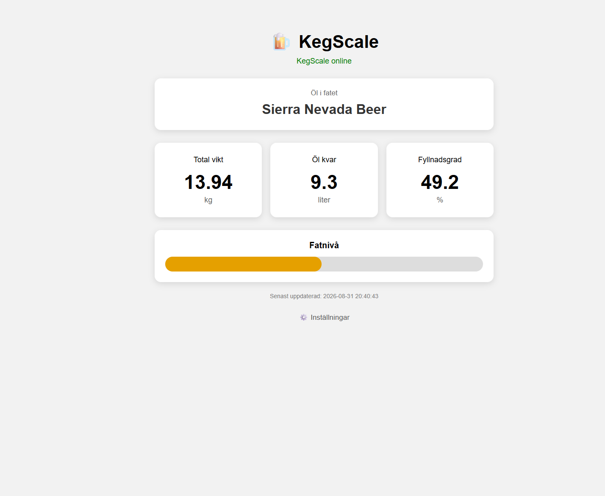
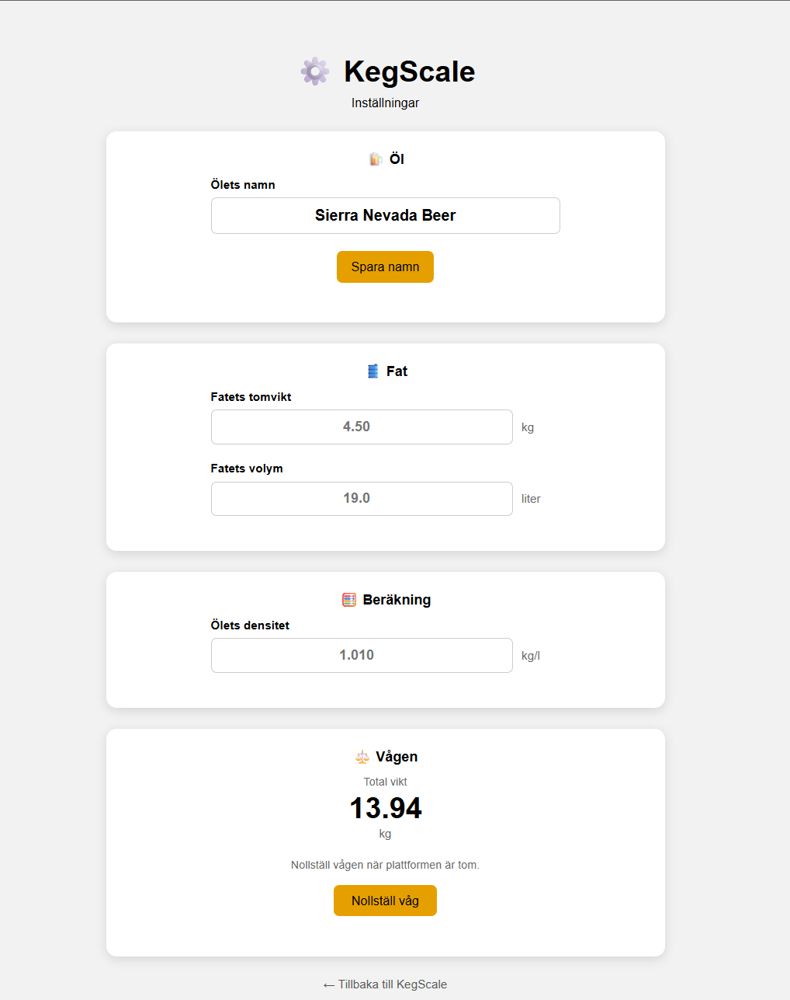

# 🍺 KegScale

**KegScale** är en Raspberry Pi-baserad våg för att mäta hur mycket öl som finns kvar i ett Corneliusfat.

Systemet använder fyra lastceller tillsammans med en HX711 och en Raspberry Pi 5. Vikten läses kontinuerligt och presenteras i ett webbaserat gränssnitt byggt med Flask.

KegScale har två webbsidor:

- **KegScale Main** – ren visningssida för vikt, mängd öl och fyllnadsgrad.
- **KegScale Setup** – används för inställningar och hantering av vågen.

På så sätt kan huvudsidan visas för andra utan risk att någon av misstag ändrar inställningar eller nollställer vågen.

---

## 🖥️ KegScale Main



Huvudsidan finns på:

```text
http://<raspberry-pi-ip>:5000/
```

Den visar:

- Ölets namn
- Total vikt
- Mängd öl kvar i liter
- Fyllnadsgrad i procent
- Grafisk nivåindikator
- Online/offline-status
- Tidpunkt för senaste mätningen

Huvudsidan är avsedd som en **ren informationssida** och innehåller inga funktioner som ändrar KegScale.

Längst ner finns en diskret länk till inställningssidan.

---

## ⚙️ KegScale Setup



Inställningssidan finns på:

```text
http://<raspberry-pi-ip>:5000/setup
```

Setup-sidan används för konfiguration och handhavande.

Den innehåller:

- Ölets namn
- Fatets tomvikt
- Fatets volym
- Ölets densitet
- Aktuell total vikt
- Nollställning av vågen

Den aktuella vikten visas direkt på setup-sidan för att göra tareringen tydligare.

> **Observera:** Ölnamn och nollställning av vågen är implementerade.  
> Fatets tomvikt, volym och ölets densitet visas på Setup-sidan men ska kopplas till konfigurationen i ett kommande steg.

---

## 🔧 Hardware

KegScale använder:

- Raspberry Pi 5
- HX711 load cell amplifier
- 4 × 50 kg lastceller
- Kopplingskort för lastcellerna
- 19 liters Corneliusfat

Fyra 50 kg lastceller ger en nominell total kapacitet på cirka **200 kg**.

### HX711


HX711 förstärker den mycket svaga signalen från lastcellerna och omvandlar den till ett digitalt 24-bitars mätvärde som Raspberry Pi kan läsa.

### Anslutning till Raspberry Pi

| HX711 | Raspberry Pi |
|---|---|
| DT / DATA | GPIO 6 |
| SCK / CLOCK | GPIO 5 |
| GND | GND |
| VCC | Matning |

Programmet använder BCM-numrering:

```python
DATA_PIN = 6
CLOCK_PIN = 5
```

---

## 🔌 Kopplingsschema

Fritzing-projekt och kopplingsschema finns i:

```text
hardware/
├── KegScale_bb.pdf
└── KegScale.fzz
```

`KegScale.fzz` kan öppnas och redigeras i Fritzing.

`KegScale_bb.pdf` innehåller kopplingsschemat i PDF-format.

---

## ⚖️ Så fungerar KegScale

Kommunikationen mellan hårdvara och webbgränssnitt ser ut så här:

```text
4 × Load cells
       │
       ▼
     HX711
       │
       ▼
Raspberry Pi GPIO
       │
       ▼
  kegscale.py
       │
       ▼
 kegscale.json
       │
       ▼
     Flask
       │
       ▼
   JavaScript
       │
       ▼
  Web browser
```

`kegscale.py` är den enda processen som kommunicerar direkt med GPIO och HX711.

Flask behöver därför inte komma åt GPIO utan läser den information som `kegscale.py` skriver till JSON.

Det gör att vågfunktionen och webbservern hålls separerade.

---

## 📏 Mätning och filtrering

För varje viktmätning:

1. 30 mätvärden läses från HX711.
2. Mätvärdena sorteras.
3. De 5 lägsta värdena tas bort.
4. De 5 högsta värdena tas bort.
5. Medelvärdet av resterande 20 mätningar beräknas.

Detta ger en stabilare vikt och minskar påverkan från enstaka störningar.

Små variationer runt noll filtreras också bort:

```python
if abs(vikt_gram) < 5:
    vikt_gram = 0.0
```

---

## 🎯 Kalibrering

Nuvarande kalibreringsfaktor:

```python
KALIBRERINGS_FAKTOR = 21.04
```

Vågen har kalibrerats med en känd vikt på cirka **3910 gram**.

Eftersom belastning gör HX711-råvärdet mer negativt beräknas vikten med:

```python
vikt_gram = -differens / KALIBRERINGS_FAKTOR
```

En separat fil finns för felsökning och kalibrering:

```text
debug_vikt.py
```

---

## 🍺 Konfiguration

Grundinställningarna finns i:

```text
config.json
```

Exempel:

```json
{
    "beer_name": "Munich Helles",
    "keg_tare_kg": 4.5,
    "keg_capacity_l": 19.0,
    "beer_density_kg_per_l": 1.01
}
```

### `beer_name`

Namnet på ölet som finns i fatet.

Ölnamnet kan ändras från **KegScale Setup** och visas sedan på **KegScale Main**.

### `keg_tare_kg`

Vikten på det tomma fatet.

Den verkliga tomvikten bör mätas för det Corneliusfat som används.

### `keg_capacity_l`

Fatets nominella volym i liter.

### `beer_density_kg_per_l`

Ölets ungefärliga densitet i kg/liter.

---

## 🧮 Beräkning av mängden öl

Först beräknas ölets vikt:

```text
Ölets vikt = Total vikt - Fatets tomvikt
```

Därefter beräknas volymen:

```text
Liter öl = Ölets vikt / Ölets densitet
```

Fyllnadsgraden beräknas med:

```text
Fyllnadsgrad = Liter öl / Fatets kapacitet × 100
```

Resultatet begränsas till:

```text
0 – 100 %
```

---

## 📄 Statusdata

`kegscale.py` skriver kontinuerligt aktuell information till:

```text
kegscale.json
```

Exempel:

```json
{
    "beer_name": "Munich Helles",
    "weight_g": 13945.1,
    "weight_kg": 13.945,
    "beer_weight_kg": 9.445,
    "beer_liters": 9.35,
    "fill_percent": 49.2,
    "keg_tare_kg": 4.5,
    "keg_capacity_l": 19.0,
    "beer_density_kg_per_l": 1.01,
    "timestamp": "2026-08-31 19:30:00"
}
```

`kegscale.json` är en runtime-fil och behöver normalt inte versionshanteras i Git.

---

## 🔄 Nollställning från Setup

Vågen kan nollställas från **KegScale Setup**.

Webbläsaren skickar:

```text
POST /api/tare
```

Flask skriver kommandot till:

```text
control.json
```

Exempel:

```json
{
    "tare": true
}
```

`kegscale.py` upptäcker kommandot, utför tareringen och återställer därefter kommandot.

```text
KegScale Setup
      │
      ▼
 POST /api/tare
      │
      ▼
    Flask
      │
      ▼
 control.json
      │
      ▼
 kegscale.py
      │
      ▼
    HX711
```

Flask kommunicerar alltså aldrig direkt med GPIO.

---

## ✏️ Ändra ölnamn

Ölnamnet ändras från **KegScale Setup**.

Flask använder:

```text
GET  /api/beer-name
POST /api/beer-name
```

När exempelvis:

```text
Munich Helles
```

ändras till:

```text
Czech Pilsner
```

sparas det nya namnet i `config.json`.

`kegscale.py` läser konfigurationen och det nya namnet visas därefter på KegScale Main.

---

## 📁 Projektstruktur

```text
KegScale/
├── .gitignore
├── config.json
├── debug_vikt.py
├── docs/
│   └── images/
│       ├── hx711.jpg
│       ├── kegscale_main.png
│       └── kegscale_setup.png
├── hardware/
│   ├── KegScale_bb.pdf
│   └── KegScale.fzz
├── kegscale.py
├── README.md
├── requirements.txt
├── test_vikt_pi5.py
└── web/
    ├── app.py
    ├── static/
    │   ├── script.js
    │   └── style.css
    └── templates/
        ├── index.html
        └── setup.html
```

Runtime-filerna:

```text
kegscale.json
control.json
```

exkluderas från Git via `.gitignore`.

---

## 🐍 Python environment

Skapa en virtuell Python-miljö:

```bash
python3 -m venv myenv
```

Aktivera den:

```bash
source myenv/bin/activate
```

Installera beroenden:

```bash
pip install -r requirements.txt
```

---

## 🚀 Starta KegScale

KegScale består av två separata processer:

1. Vågen
2. Flask-webbservern

### Terminal 1 – KegScale

```bash
cd ~/Projects/KegScale
source myenv/bin/activate
python kegscale.py
```

### Terminal 2 – Flask

```bash
cd ~/Projects/KegScale
source myenv/bin/activate
cd web
python app.py
```

Flask-servern körs på:

```text
0.0.0.0:5000
```

### KegScale Main

```text
http://<raspberry-pi-ip>:5000/
```

### KegScale Setup

```text
http://<raspberry-pi-ip>:5000/setup
```

---

## 🌐 API

### Läs vågdata

```text
GET /api/weight
```

Returnerar bland annat:

- Ölnamn
- Total vikt
- Mängd öl
- Fyllnadsgrad
- Tidstämpel
- Online/offline-status

### Nollställ vågen

```text
POST /api/tare
```

### Läs ölnamn

```text
GET /api/beer-name
```

### Ändra ölnamn

```text
POST /api/beer-name
```

Exempel:

```json
{
    "beer_name": "Munich Helles"
}
```

---

## ✅ Current features

- [x] Raspberry Pi 5
- [x] HX711 communication
- [x] 4 × 50 kg load cells
- [x] Digital filtering
- [x] Scale calibration
- [x] Weight in grams and kilograms
- [x] Beer volume calculation
- [x] Keg fill percentage
- [x] JSON status
- [x] Flask web interface
- [x] Automatic web updates
- [x] Online/offline detection
- [x] Graphical keg level
- [x] Separate Main and Setup pages
- [x] Read-only Main page
- [x] Editable beer name from Setup
- [x] Web-based scale tare
- [x] Live total weight on Setup page
- [x] Hardware documentation
- [x] Fritzing project and PDF wiring diagram

---

## 🔮 Planned features

- [ ] Save keg tare weight from Setup
- [ ] Use current scale weight as keg tare weight
- [ ] Save keg capacity from Setup
- [ ] Save beer density from Setup
- [ ] Support different keg sizes
- [ ] Save scale offset between restarts
- [ ] Automatic startup with systemd
- [ ] Historical consumption data
- [ ] Multiple keg support

---

## 📌 Status

KegScale är nu ett fungerande Raspberry Pi-baserat mätsystem med separat vågprocess och Flask-webbserver.

Vågen är kalibrerad och testad. **KegScale Main** visar aktuell vikt, mängden öl och fatets fyllnadsgrad, medan **KegScale Setup** används för inställningar och tarering.

Nästa utvecklingssteg är att göra fatets tomvikt, volym och ölets densitet fullt redigerbara från Setup-sidan.

🍺 **Current keg: Munich Helles**